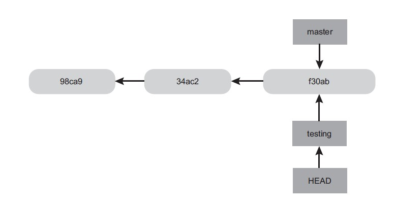

# **Основы контроля версий**

# 1. Установка в Windows

* На странице http://git-scm.com/download/win выбрать дистрибутив для закачки под свою версию ОС.
* Скачать.
* Установить с параметрами по-умолчанию.

# 2. Настройка. Задать идентификаторы

Для корректой работы Git указать имя и адрес электронной почты для идентификации:

 git config --global user.name "John Doe"

 git config --global user.email johndoe@example.com

 Для проверки можно задать значение конкретного ключа, воспользовавшись командой 
 *git config <ключ>*

 например:

*git config user.name*

# Параметры команды Git

## Три способа доступа к странице со справочной информацией по любой Git-команде:
git help <команда>

git <команда> --help

man git-<команда>

К примеру, справка по команде config открывается так:

git help config

## Инициализация репозитория

В терминале командой cd устанавливаем текущий каталог - который хотим сделать репозиторием. Вводим команду:

git init

## Проверка состояния файлов

Командой *git status* проверяем состояние репозитория и наличие файлов, включенных и не включенных в контроль

## Добавление файлов на отслеживание и фиксация

Чтобы начать управление версиями существующих файлов (в противовес пустому каталогу), укажите файлы, за которыми должна следить система, и выполните первую фиксацию изменений:

*git add .*

*git add FILE_NAME.EXT*

Tab - позволяет делать автозаполнение.
Add - Это многоцелевая команда, позволяющая начать слежение за новыми файлами, произвести индексирование файлов, а также пометить файлы с конфликтом слияния как разрешенные. Целесообразнее воспринимать эту команду как «добавление содержимого к следующему коммиту».

**Важно! Редактирование файла после выполнения команды git add требует повторного запуска этой команды для индексирования самой последней версии файла.**

*git commit -m 'первоначальная версия проекта'* - фиксирует проиндексированные изменения.

Командой git commit с параметром -a, система Git начнет автоматически индексировать все отслеживаемые файлы перед их фиксацией, позволяя обойтись без команды git add:

"git add <file>..." to update what will be committed

git commit -a -m 'added new benchmarks'

## Клонирование существующего репозитория

Клонирование репозитория осуществляется командой 

*git clone [url]*

 К примеру, вот как клонируется подключаемая Git-библиотека libgit2:

*git clone https://github.com/libgit2/libgit2*

Команда создает папку с именем libgit2, инициализирует в ней папку .git, считывает из репозитория все данные и выгружает рабочую копию последней версии. В папке libgit2 вы найдете все файлы проекта, подготовленные к работе. Репозиторий можно клонировать и в другое место, достаточно указать имя нужной папки в следующем параметре командной строки:

*git clone https://github.com/libgit2/libgit2 mylibgit*

Эта команда делает то же самое, что и предыдущая, но все файлы оказываются в папке mylibgit.

## Игнорирование файлов

Cоздается файл .gitignore со списком соответствующих паттернов. Вот пример такого файла:

cat .gitignore

*.[oa]

*~

Первая строка заставляет Git игнорировать любые файлы, заканчивающиеся на «.o» или «.a», — объектные и архивные файлы, которые могут появляться в процессе сборки кода. Вторая строка предписывает игнорировать файлы, заканчивающиеся на тильду (~). Этим значком многие текстовые редакторы обозначают временные файлы. В этот список можно включить также папки log, tmp или pid, автоматически генерируемую документацию и т. п. Работу всегда имеет смысл начинать с настройки файла .gitignore, так как это защищает от случайного добавления в репозиторий файлов, которые там не нужны.

Звездочка (*) замещает произвольное число символов, запись [abc] соответствует любому символу из указанных в скобках (в данном случае это символ a, b или c), знак вопроса (?) замещает собой один символ, а разделенные дефисом символы в квадратных скобках ([0-9]) совпадают с любым символом из указанного диапазона (в данном случае от 0 до 9). Кроме того, две звездочки применяются для обозначения вложенных папок; запись a/**/z может означать a/z, a/b/z, a/b/c/z и т. д.

Много примеров находится на странице https://github.com/github/gitignore

## Просмотр индексированных и неиндексированных изменений

команда *git diff* показывает добавленные и удаленные строки — то есть все вставки в программу. <ез дополнительных параметров команда позволяет посмотреть, что было изменено, но пока не проиндексировано.

## Удаление файлов

Команда git rm, которая заодно удаляет указанный файл из рабочей папки, благодаря чему он исчезает из списка неотслеживаемых

## Просмотр истории версий

git log

По умолчанию при отсутствии параметров команда git log выводит в обратном хронологическом порядке список сохраненных в данный репозиторий версий.

Одним из самых полезных является параметр -p, показывающий разницу, внесенную каждым коммитом. А дополнительный параметр -2 ограничивает выводимый результат последними двумя записями:

git log -p -2

Параметр --graph добавляет небольшой ASCII-граф с историей ветвлений и слияний.

## Создание тегов.

Для просмотра списка доступных тегов применяется очевидная команда git tag:

git tag -l ‚v1.8.5*

Для создания требуется добавить параметр -a к команде tag:

git tag -a v1.4 -m 'my version 1.4'

Параметр -m задает сообщение, которое будет храниться вместе с тегом.

Тег можно сделать и позже, указав в конце команды контрольную сумму коммита (или ее часть):
git tag -a v1.2 9fceb02

Для просмотра данных тега вместе с помеченным им коммитом служит команда git show:  git show v1.4

# Ветвления

## Создание новой ветки

Эта операция выполняется командой git branch:

git branch testing

Появится новый указатель на ваш текущий коммит.

## Смена веток

Переход на существующую ветку реализует команда git checkout. Перейдем на ветку testing:

git checkout testing

Теперь указатель HEAD нацелен на ветку testing.

## Слияние веток

Перед слиянием, фиксируем состояние изменений.
Затем переходим в ветку в которую хотим выполнить слияние. Допустим основную master.
Используем команду merge для слияния с веткой по имени hitfix:

git checkout master

git merge hotfix

Если ветка после слияния не нужна - её можно удалить. Для этого достаточно добавить параметр -d к команде git branch:

git branch -d hotfix

## Конфликты при слиянии

Если в двух ветках, которые вы собираетесь слить, вы внесли разные изменения в один и тот же файл, Git не сможет просто взять и объединить их. Система приостанавливает процесс до момента разрешения конфликта. Посмотреть, какие файлы не прошли слияние после возникновения конфликта, позволяет команда:

 git status

Версия с указателем HEAD (из ветки master, так как именно в нее перешли перед выполнением команды merge) располагается в верхней части блока (то есть выше набора символов =======), а версия из ветки слияния показана в нижней части. Для разрешения конфликта следует или выбрать одну из версий, или каким‑то образом объединить их.

После завершения работы с инструментом слияния Git спросит, удалось ли разрешить конфликты. В случае положительного ответа файл индексируется, что означает разрешение конфликта. Убедиться в том, что это действительно так, позволяет команда git status.

## Управление ветками

Команда git branch запущенная без аргументов, выводит на экран список имеющихся веток:

git branch

iss53

 *master

testing

Обратите внимание на символ * перед веткой master: он указывает, что именно в этой ветке вы сейчас находитесь (то есть именно на нее нацелен указатель HEAD).

**Git – локальный клиент системы контроля версий**

**GitHub – удалённый сервис контроля версий**

Очевидны минимум два варианта работы с сервером 

# Вариант 1. Клонирование репозитория с GitHub на локальный ПК и работа с копией:

*git clone (ссылка)*

# Вариант 2. Отправка ранее созданного локального репозитория на GitHub (может потребоваться авторизация):

-	Создать на GitHub репозиторий
-	локальными командами связать удаленный репозиторий с локальным, указать основную ветку, протолкнуть изменения:

*git remote add origin https://github.com/MaksimMonastyrshin/Lesson_3_1.git*

*git branch -M main*

*git push -u origin main*

> При первом подключении к удаленному репозиторию, Git предложит авторизоваться - ввести логин и пароль от учетной записи на GitHub для подтверждения прав на изменение удаленного репозитория. Последующие подключения посли привязки к репозиторию, ввода учетных данных не потребуют.

